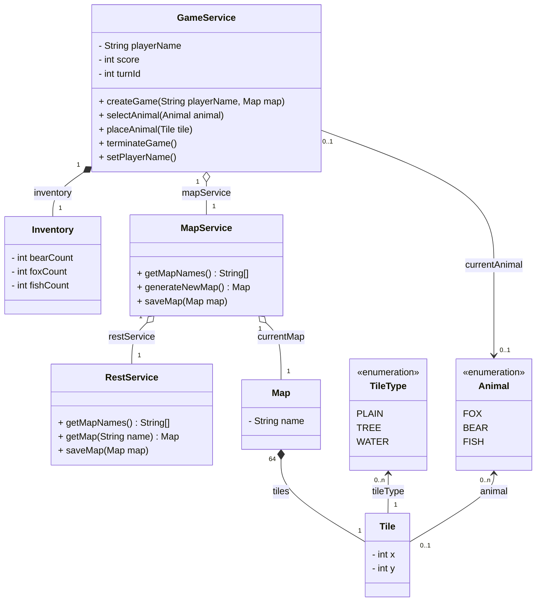
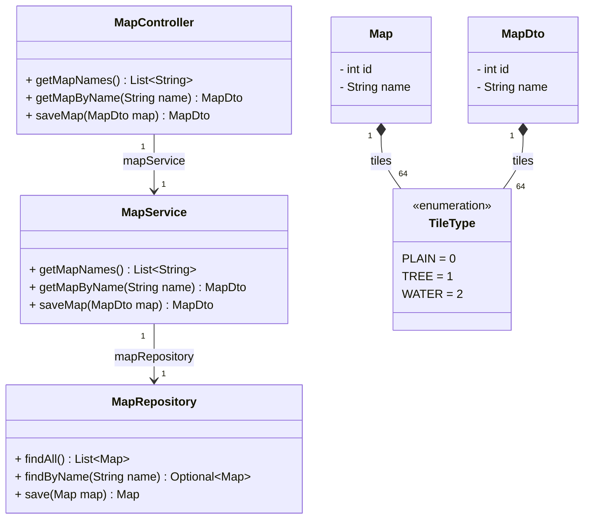
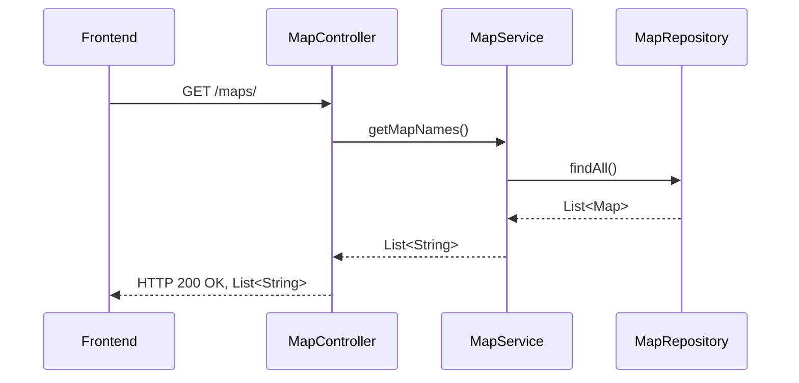
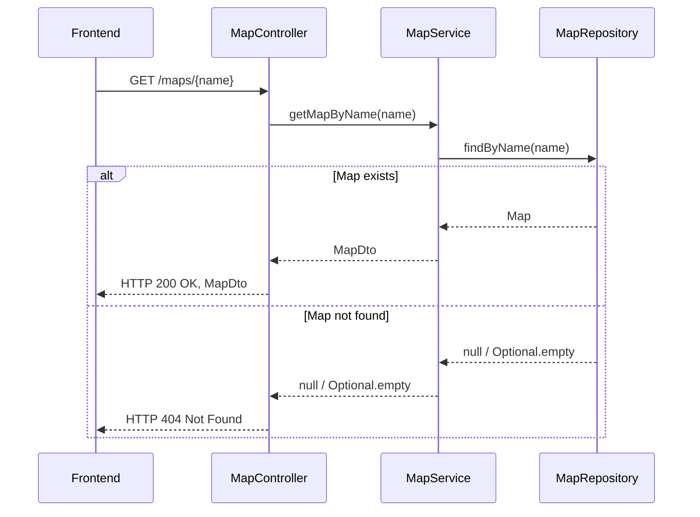
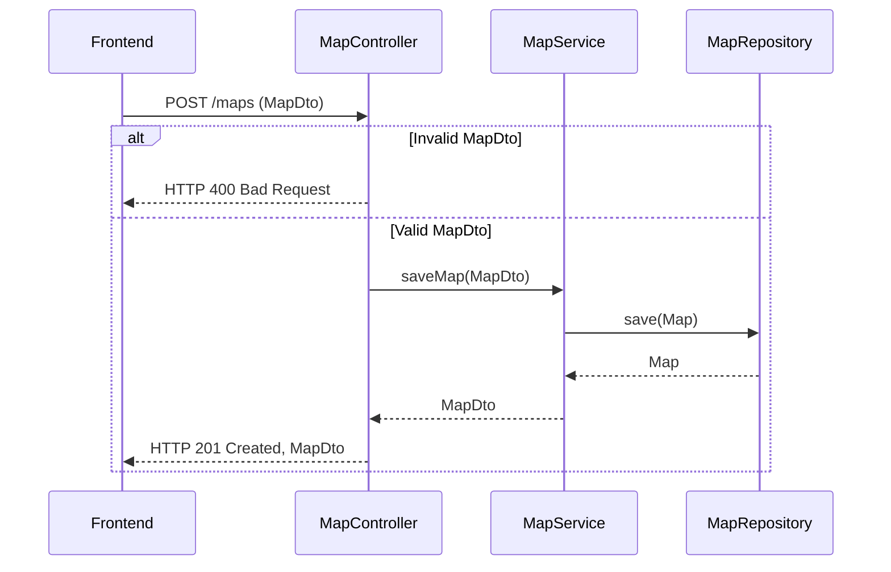

# Documentation Technique – Projet Web 2

## Diagrammes UML

---

### Frontend



---

### Backend



---

## Diagrammes de séquence

### 🔹 Récupération des noms de maps



---

### 🔹 Récupération d’une map par son nom



---

### 🔹 Sauvegarde d’une map



---

## Spécification OpenAPI (Backend → Frontend)

```yaml
openapi: 3.1.0
info:
  title: Projet Web 2
  version: 1.0.0
  description: |-
    Spécification de l'API REST exposée par le backend.

    Cette API permet au frontend d'intéragir avec le backend et de pouvoir récupérer les maps déjà existantes et d'en créer de nouvelles.
  license:
    name: MIT
    url: https://gitlab.insa-rennes.fr/fbartra/web2-bartra-laine/-/raw/main/LICENSE?ref_type=heads
servers:
  - url: https://127.0.0.1:8080
defaultContentType: application/json
tags:
  - name: Maps
    description: Opération sur les maps.
paths:
  /maps:
    get:
      tags:
        - Maps
      summary: Récupérer les noms des maps.
      description: Cette route permet de récupérer les noms des maps.
      responses:
        '200':
          description: Noms des maps récupérés avec succès.
          content:
            application/json:
              schema:
                type: array
                items:
                  $ref: '#/components/schemas/MapName'
    post:
      tags:
        - Maps
      summary: Sauvegarder une map.
      description: Cette route permet de sauvegarder une map.
      requestBody:
        description: La map à sauvegarder.
        content:
          application/json:
            schema:
              $ref: '#/components/schemas/Map'
        required: true
      responses:
        '201':
          description: Map sauvegardée avec succès.
          content:
            application/json:
              schema:
                $ref: '#/components/schemas/Map'
        '400':
          description: Body de la requête invalide.
          content:
            application/json:
              schema:
                $ref: '#/components/schemas/Error'
  /maps/by-name:
    get:
      tags:
        - Maps
      summary: Récupérer une map à partir de son nom.
      description: Cette route permet de récupérer une map à partir de son nom.
      parameters:
        - name: name
          in: query
          description: Nom de la map.
          required: true
          schema:
            $ref: '#/components/schemas/MapName'
      responses:
        '200':
          description: Map trouvée.
          content:
            application/json:
              schema:
                $ref: '#/components/schemas/Map'
        '404':
          description: Aucune map trouvée.
          content:
            application/json:
              schema:
                $ref: '#/components/schemas/Error'

components:
  schemas:
    MapName:
      type: string
      description: Nom de la map.
      examples:
        - Map 1
        - Map 2
    Map:
      type: object
      description: Une map du jeu avec un nom et les cases qui la compose.
      properties:
        id:
          type: integer
          description: Identifiant unique de la map.
          format: int64
          minimum: 1
        name:
          $ref: '#/components/schemas/MapName'
        tiles:
          type: array
          description: Tableau de 8 par 8 contenant les types des cases.
          items:
            $ref: '#/components/schemas/TileType'
          minItems: 64
          maxItems: 64
      required:
        - id
        - name
        - tiles
    TileType:
      type: integer
      description: >
        Les différents types de cases dans une map:

        - `0` - Plain.
        - `1` - Tree.
        - `2` - Water.
      enum: [0, 1, 2]
    Error:
      type: object
      description: Erreur renvoyée par le serveur.
      properties:
        code:
          type: string
        message:
          type: string
      required:
        - code
        - message
```